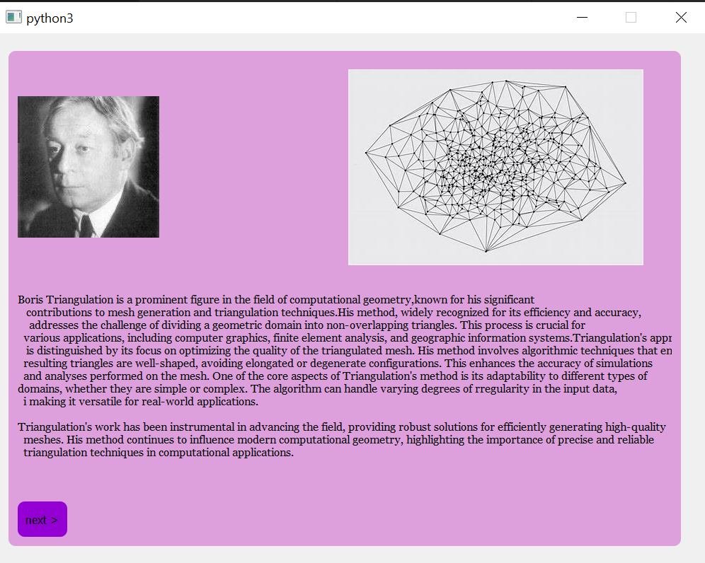
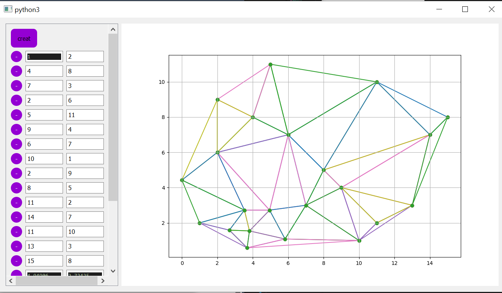

## README

# Triangulation Project

This project involves a Python application that demonstrates the process of triangulation—a method of dividing a geometric domain into triangles. The project includes a PyQt5-based graphical user interface (GUI) that allows users to visualize the triangulation process.

### Table of Contents
- [Project Overview](#project-overview)
- [Features](#features)
- [Installation](#installation)
- [Usage](#usage)
- [Files](#files)
- [Dependencies](#dependencies)
- [Contributing](#contributing)

## Project Overview
Triangulation is a fundamental technique used in various fields such as computer graphics, finite element analysis, and geographic information systems. This project implements a triangulation algorithm and provides a GUI to visualize and interact with the triangulation process.

### Features
- **Triangulation Algorithm:** Implements a robust triangulation algorithm that divides a set of points into non-overlapping triangles.
- **GUI Visualization:** The PyQt5-based GUI allows users to view the triangulated mesh and interact with the application.
- **Matplotlib Integration:** Uses matplotlib to plot and visualize the triangulated mesh.

## Application Screenshots

Below are some screenshots of the application:

### Main Window


### Triangulation Example

### link to download the programme.exe 
[Download triangulationwindow.exe](https://drive.google.com/drive/folders/1gkRqrMBsg1b7xz-tZJJGiu8Y-Oe1X5hD?usp=drive_link)


## Installation

1. **Clone the repository:**
   ```bash
   git clone <repository-url>
```bash
   cd triangulation-project
#


